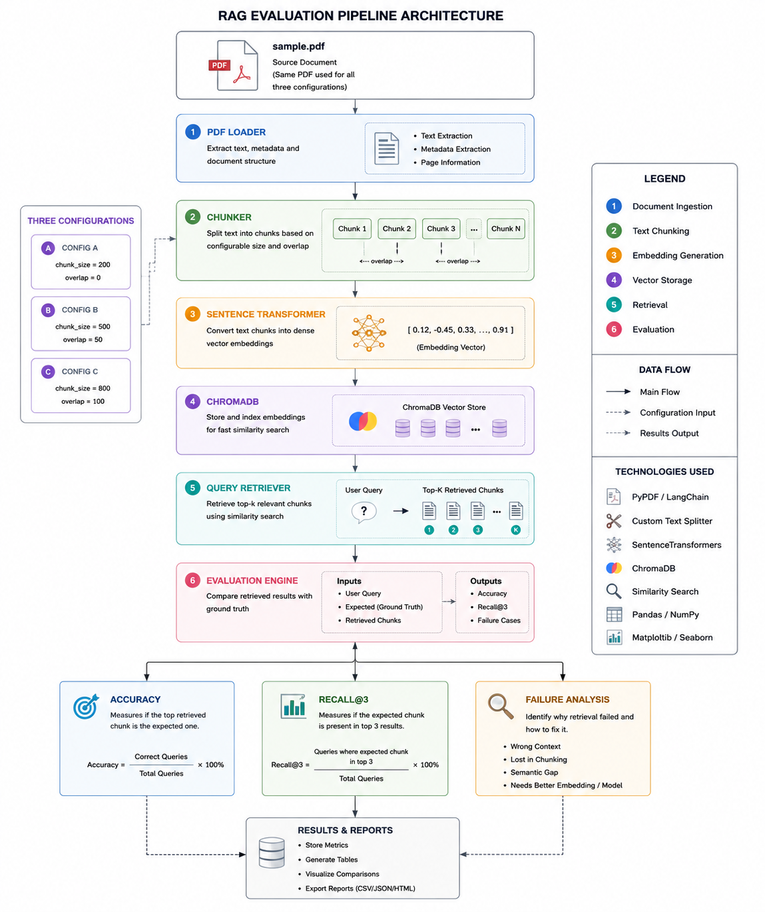
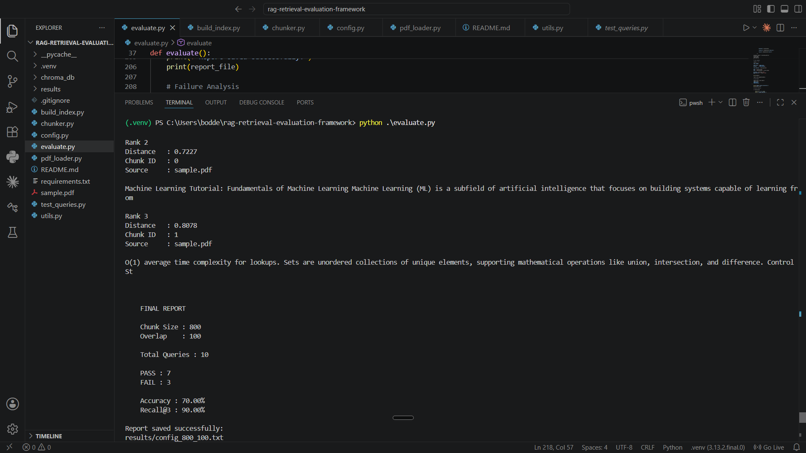

# RAG Retrieval Evaluation Framework

A modular Retrieval-Augmented Generation (RAG) evaluation framework built with **Python**, **ChromaDB**, and **Sentence Transformers** to analyze how different chunking configurations affect retrieval performance.

This project focuses on one of the most important stages of every RAG system: **retrieval quality**. Instead of building a chatbot directly, the project evaluates and compares retrieval strategies using measurable metrics such as **Accuracy** and **Recall@3**.

---

# Project Objective

The goal of this project is to understand how document chunking impacts semantic retrieval performance.

Three different chunking configurations were evaluated using:

* The same PDF document
* The same embedding model
* The same vector database
* The same evaluation queries

This creates a controlled experiment where only the chunking configuration changes.

---

# Features

* 📄 PDF Text Extraction
* ✂️ Fixed-Size Chunking with Configurable Overlap
* 🧠 Sentence Transformer Embeddings
* 🗄️ ChromaDB Persistent Vector Database
* 🔍 Semantic Similarity Search
* 📊 Retrieval Evaluation Framework
* ✅ Accuracy Calculation
* ✅ Recall@3 Calculation
* 📉 Retrieval Failure Analysis
* ⚙️ Configurable Experiment Settings
* 📁 Automatic Evaluation Report Generation
* 🧩 Modular Project Architecture

---

# Project Architecture
```

                    sample.pdf
                         │
                         ▼
                  PDF Loader
                         │
                         ▼
                    Chunker
                         │
                         ▼
              Sentence Transformer
                         │
                         ▼
                    ChromaDB
                         │
                         ▼
                 Semantic Retrieval
                         │
                         ▼
               Evaluation Framework
                         │
        ┌────────────────┴────────────────┐
        ▼                                 ▼
    Accuracy                         Recall@3
        │                                 │
        └────────────────┬────────────────┘
                         ▼
                 Failure Analysis
```

---

# Architecture Diagram



---

# Project Structure

```
rag_evaluation_miniproject/
│
├── build_index.py
├── chunker.py
├── config.py
├── evaluate.py
├── pdf_loader.py
├── requirements.txt
├── sample.pdf
├── test_queries.py
├── utils.py
├── README.md
├── .gitignore
│
├── chroma_db/
└── results/
```

---

# Technologies Used

| Technology            | Purpose                 |
| --------------------- | ----------------------- |
| Python                | Core Programming        |
| ChromaDB              | Vector Database         |
| Sentence Transformers | Text Embeddings         |
| PyPDF                 | PDF Text Extraction     |
| NumPy                 | Numerical Operations    |
| VS Code               | Development Environment |

---

# Installation

Clone the repository:

```bash
git clone https://github.com/<boddetijayanth22>/rag-retrieval-evaluation-framework.git

cd rag-retrieval-evaluation-framework
```

Create a virtual environment:

```bash
python -m venv .venv
```

Activate it:

**Windows**

```bash
.venv\Scripts\activate
```

Install dependencies:

```bash
pip install -r requirements.txt
```

---

# Running the Project

## Step 1 — Build the Vector Index

```bash
python build_index.py
```

This will:

* Load the PDF
* Extract text
* Create chunks
* Generate embeddings
* Store vectors in ChromaDB

---

## Step 2 — Evaluate Retrieval

```bash
python evaluate.py
```

The evaluation framework automatically:

* Runs all test queries
* Retrieves Top-K chunks
* Calculates Accuracy
* Calculates Recall@3
* Performs Failure Analysis
* Saves an evaluation report

---

# Experimental Configurations

Three different chunking strategies were evaluated.

| Configuration | Chunk Size | Overlap |
| ------------- | ---------: | ------: |
| A             |        200 |       0 |
| B             |        500 |      50 |
| C             |        800 |     100 |

Only the chunking parameters were changed while keeping every other component identical.

---

# Experimental Results

| Configuration | Accuracy | Recall@3 |
| ------------- | -------: | -------: |
| A             |      60% |      80% |
| B             |      60% |      80% |
| C             |  **70%** |  **90%** |

---

# Evaluation Output



---

### Best Performing Configuration

**Chunk Size:** 800

**Overlap:** 100

This configuration produced the highest retrieval performance for the evaluation dataset.

---

# Evaluation Metrics

The framework measures:

* Top-1 Accuracy
* Recall@3
* Retrieved Chunks
* Similarity Distances
* Retrieval Failures

Each evaluation produces a report inside the **results/** directory.

---

# Key Learnings

During this project I learned:

* Building a modular RAG preprocessing pipeline
* PDF parsing and preprocessing
* Fixed-size document chunking
* Configurable chunk overlap
* Vector indexing using ChromaDB
* Semantic retrieval using embeddings
* Measuring retrieval quality with Accuracy and Recall
* Performing retrieval failure analysis
* Designing controlled experiments for RAG systems

---

# Future Improvements

Future enhancements include:

* Recursive Chunking
* Semantic Chunking
* Metadata-Based Retrieval
* Hybrid Search (BM25 + Dense Retrieval)
* Reranking Models
* Multiple Embedding Model Comparison
* End-to-End RAG Chatbot
* LLM-based Answer Generation
* Answer Faithfulness Evaluation

---

# Repository Highlights

* Modular Python project structure
* Configurable retrieval experiments
* Reproducible evaluation pipeline
* Automatic report generation
* Clean separation of indexing and evaluation

---

# Author

**B. Jayanth**

Computer Science Graduate(AI/ML) | Aspiring Generative AI Engineer

Focused on:

* Retrieval-Augmented Generation (RAG)
* Large Language Models (LLMs)
* AI Engineering
* Vector Databases
* Machine Learning

---

## ⭐ If you found this project useful, consider giving it a star!